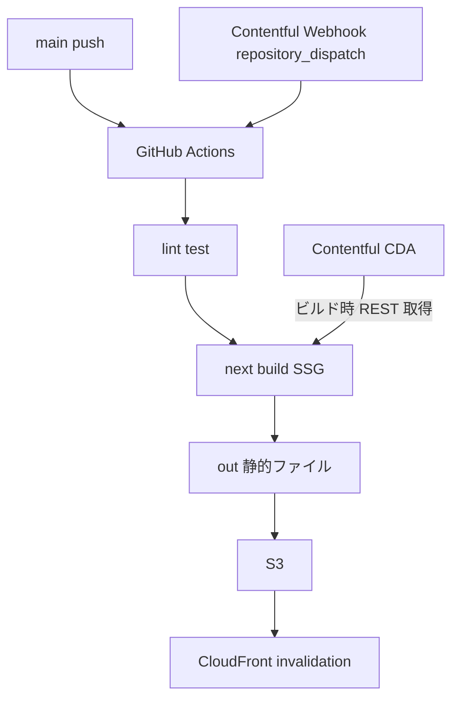
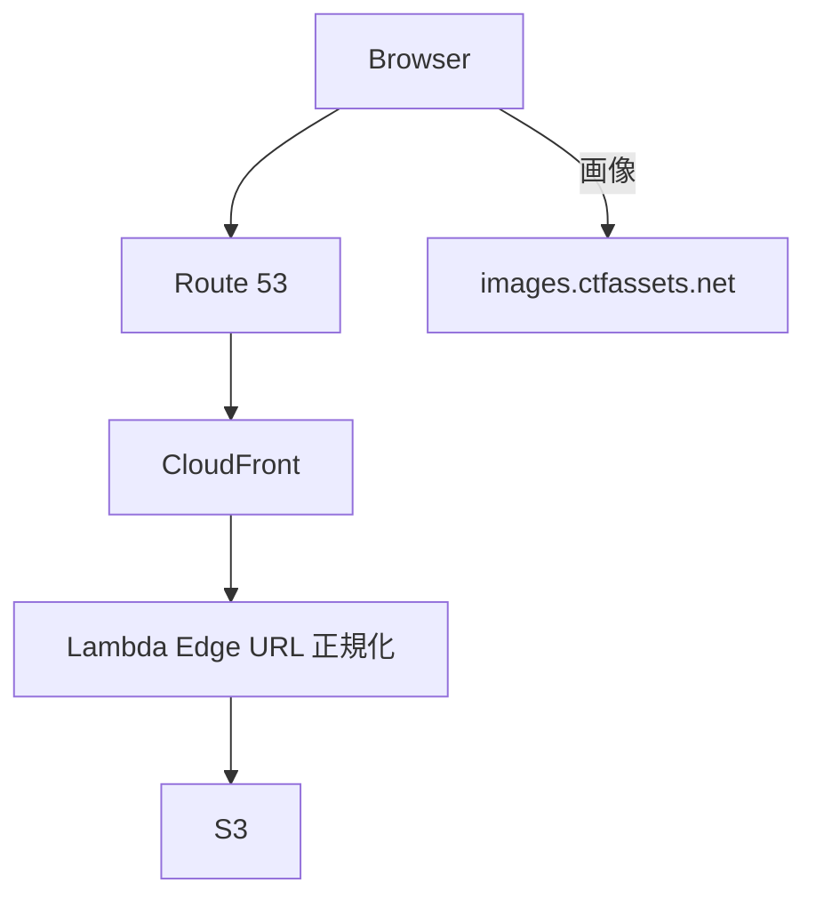
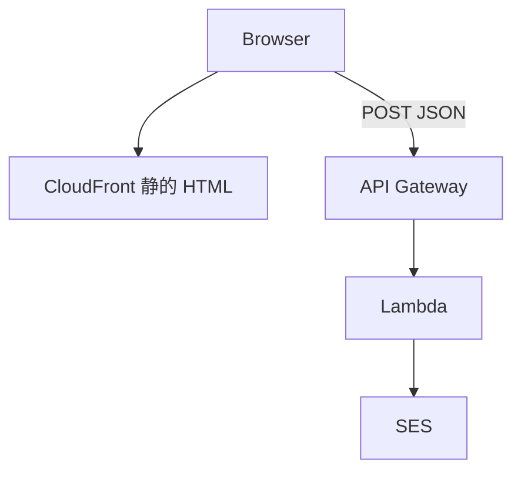
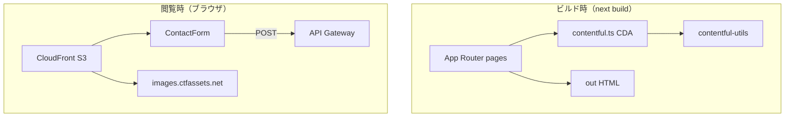

# next-portfolio

[msykn.com](https://msykn.com/) のソースコード。Nuxt.js 版から Next.js App Router へリプレイスした個人ポートフォリオサイトです。

旧リポジトリ: [nuxt-portfolio](https://github.com/masayukinii1011/nuxt-portfolio)

## 技術スタック

| 領域 | 採用技術 |
| --- | --- |
| フロント | Next.js 16 (App Router) / React 19 / TypeScript |
| UI | shadcn/ui / Tailwind CSS |
| CMS | Contentful (REST CDA) |
| ホスティング | S3 + CloudFront + Route 53 |
| コンタクト | Lambda + API Gateway + SES |
| CI/CD | GitHub Actions |
| 品質 | Biome / Vitest |

## アーキテクチャ

### ビルド時（CI/CD）



### 閲覧時（ランタイム）



### 問い合わせ（ランタイム・別系統）



- `output: "export"` による完全静的エクスポート（Contentful はビルド時のみ取得、閲覧時は S3 上の HTML を配信）
- デプロイのトリガーは `main` push と Contentful Webhook（`repository_dispatch`）の 2 系統
- GitHub Actions は lint / test の後にビルドし、S3 sync と CloudFront invalidation まで実行
- 画像はランタイムで Contentful CDN（`images.ctfassets.net`）から直接取得
- 問い合わせ POST は CloudFront を経由せず、ビルド時に埋め込んだ API Gateway URL へ直接送信

### アプリ構造図



## ページ構成

| パス | 内容 |
| --- | --- |
| `/` | ヒーロー・CTA・最新 Works |
| `/about` | プロフィール・スキル（Contentful） |
| `/works` | 作品一覧（Contentful） |
| `/works/[slug]` | 作品詳細（Contentful） |
| `/music` | 音楽活動（Contentful + embed） |
| `/contact` | 問い合わせフォーム（Contentful + Lambda） |

## ローカル開発

### 環境変数

`.env.local` に以下を設定します。

```env
CTF_SPACE_ID=
CTF_CDA_ACCESS_TOKEN=
CTF_BLOG_POST_TYPE_ID=
SEND_MESSAGE_API=
```

### コマンド

```bash
npm ci
npm run dev      # 開発サーバー
npm run lint     # Biome
npm run test     # Vitest
npm run build    # 静的エクスポート (out/)
```

## デプロイ

`main` への push、または Contentful Webhook による `repository_dispatch` で GitHub Actions が実行されます。ビルド後 `out/` を S3 に sync し、CloudFront を invalidation します。手順の詳細は [docs/runbook.md](docs/runbook.md) を参照。

## ドキュメント

| ドキュメント | 内容 |
| --- | --- |
| [docs/runbook.md](docs/runbook.md) | 環境変数、CI/CD、障害時、Webhook |
| [docs/architecture.md](docs/architecture.md) | 層構造、ビルド時 / 閲覧時のデータ流れ |
| [docs/content-model.md](docs/content-model.md) | Contentful Content Type、Post 型、category 約定 |
| [docs/frontend.md](docs/frontend.md) | Server / Client 境界、View Transitions、Markdown |
| [docs/adr/README.md](docs/adr/README.md) | ADR（採用理由・設計判断の記録） |
| [src/app/contentful.ts](src/app/contentful.ts) | CDA 取得 API（コード正本） |
| [src/lib/contentful-utils.ts](src/lib/contentful-utils.ts) | Entry → Post 変換（コード正本） |

## 技術選定（要約）

詳細な理由・トレードオフは [docs/adr/](docs/adr/README.md) を参照。

| テーマ | 決定 | ADR |
| --- | --- | --- |
| 配信形態 | 静的エクスポート + S3 / CloudFront | [0001](docs/adr/0001-nextjs-static-export.md), [0002](docs/adr/0002-aws-s3-cloudfront-hosting.md) |
| CMS | Contentful REST、ビルド時取得 | [0003](docs/adr/0003-contentful-rest-cda.md) |
| UI | shadcn/ui + Tailwind | [0004](docs/adr/0004-shadcn-tailwind-ui.md) |
| 問い合わせ | Client POST → Lambda / SES | [0005](docs/adr/0005-contact-lambda-not-server-actions.md) |
| フレームワーク | Next.js 16 / React 19 | [0006](docs/adr/0006-nextjs-16-react-19.md) |

Next.js を選んだ背景: RSC と SSG の組み合わせ。Remix / Astro も検討したが App Router と静的 export の両立を優先。

## 実装上のポイント

- **モバイルメニュー** — 画面遷移時に Sheet を閉じるため Client Component + `usePathname`（[`MobileMenu.tsx`](src/app/components/MobileMenu.tsx)）
- **コンタクトフォーム** — SSG では Server Actions が使えないため Client 側から API へ POST（[`ContactForm.tsx`](src/app/components/ContactForm.tsx)）
- **SEO** — ページ別 metadata / sitemap / robots / 404
- **View Transitions** — React 19.2 のページ遷移アニメーション（方向付きスライド + Works サムネ morph）
- **Contact API** — フロントに honeypot を実装
