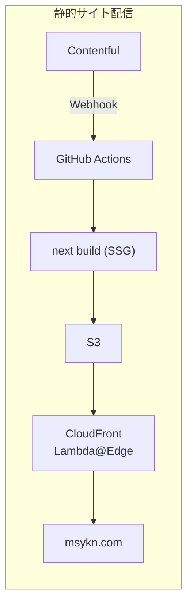
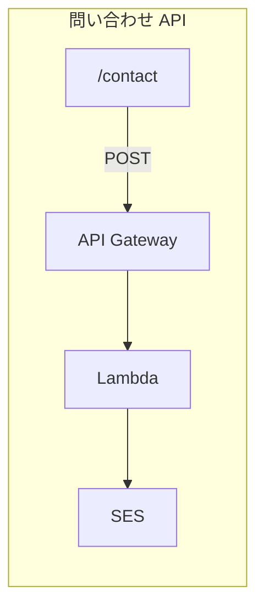

# next-portfolio

[msykn.com](https://msykn.com/) のソースコード。Nuxt.js 版から Next.js App Router へリプレイスした個人ポートフォリオサイトです。

旧リポジトリ: [nuxt-portfolio](https://github.com/masayukinii1011/nuxt-portfolio)

## 技術スタック

| 領域 | 採用技術 |
|------|---------|
| フロント | Next.js 16 (App Router) / React 19 / TypeScript |
| UI | shadcn/ui / Tailwind CSS |
| CMS | Contentful (REST CDA) |
| ホスティング | S3 + CloudFront + Route 53 |
| コンタクト | Lambda + API Gateway + SES |
| CI/CD | GitHub Actions |
| 品質 | Biome / Vitest |

## アーキテクチャ





- `output: "export"` による完全静的エクスポート
- Contentful 更新時に Webhook で自動ビルド・デプロイ
- Lambda@Edge による URL 正規化（旧構成から継続）

## ページ構成

| パス | 内容 |
|------|------|
| `/` | ヒーロー・CTA・最新 Works |
| `/about` | プロフィール・スキル（Contentful） |
| `/works` | 作品一覧（Contentful） |
| `/works/[slug]` | 作品詳細（Contentful） |
| `/music` | 音楽活動（Contentful + embed） |
| `/contact` | 問い合わせフォーム（Contentful + Lambda） |

## ローカル開発

### 環境変数

`.env.local` に以下を設定します。

```env
CTF_SPACE_ID=
CTF_CDA_ACCESS_TOKEN=
CTF_BLOG_POST_TYPE_ID=
SEND_MESSAGE_API=
```

### コマンド

```bash
npm ci
npm run dev      # 開発サーバー
npm run lint     # Biome
npm run test     # Vitest
npm run build    # 静的エクスポート (out/)
```

## デプロイ

`main` への push、または Contentful Webhook による `repository_dispatch` で GitHub Actions が実行されます。ビルド後 `out/` を S3 に sync し、CloudFront を invalidation します。

## 技術選定

### Next.js
React Server Component と SSG を組み合わせたいため採用。Remix や Astro も検討しましたが、App Router の体験と静的エクスポートの両立を優先しました。

### Next.js 16 へのアップグレード（2026）
Next.js 15 / React 18 から **Next.js 16 / React 19** へ更新しました。

**上げた理由**
- **Turbopack 本番ビルド** — v16 で dev / build ともデフォルト化。CI のビルド時間短縮が見込める
- **View Transitions** — React 19.2 の API でページ遷移 UX を改善（方向付きスライド、Works サムネ → 詳細の morph）
- **サポート継続** — Node.js 20.9+ / React 19 が前提の現行 LTS に合わせ、将来のセキュリティ修正を取り込みやすくする

**採用しなかった v16 機能**
- Cache Components / `use cache` / PPR — `output: "export"` の静的ホスティング構成では非対応のため見送り
- React Compiler — ビルド時間増のトレードオフのため見送り（UX 改善は View Transitions で対応）

**依存関係の更新方針**
- Next / React / 型定義は v16 移行に合わせて更新
- Radix UI、react-hook-form、contentful 等は **同一メジャー内** の互換パッチへ更新
- Tailwind CSS 4、Zod 4、Biome 2 など破壊的変更のあるメジャーアップは、別途移行計画を立ててから検討

### shadcn/ui + Tailwind CSS
RSC 対応・zero runtime・カスタマイズ性を重視。コンポーネントがプロジェクト内に配置されるため、node_modules 依存より改修しやすいと感じました。

### AWS（Vercel ではなく）
更新頻度が低く ISR のメリットが薄いため、Contentful Webhook 連携の CI/CD で十分と判断。旧構成を踏襲しています。

### Contentful REST（GraphQL ではなく）
GraphQL API も検討しましたが、記事数が少なく SSG ビルド時のみ取得する構成のため、REST + `contentful` SDK の方がシンプルで十分と判断しました。CMS 構成が複雑化した場合は GraphQL への移行を検討します。

## 実装上のポイント

- **モバイルメニュー** — 画面遷移時に Sheet を閉じるため Client Component + `usePathname`（[`MobileMenu.tsx`](src/app/components/MobileMenu.tsx)）
- **コンタクトフォーム** — SSG では Server Actions が使えないため Client 側から API へ POST（[`ContactForm.tsx`](src/app/components/ContactForm.tsx)）
- **SEO** — ページ別 metadata / sitemap / robots / 404
- **View Transitions** — React 19.2 のページ遷移アニメーション（方向付きスライド + Works サムネ morph）
- **Contact API** — フロントに honeypot を実装
