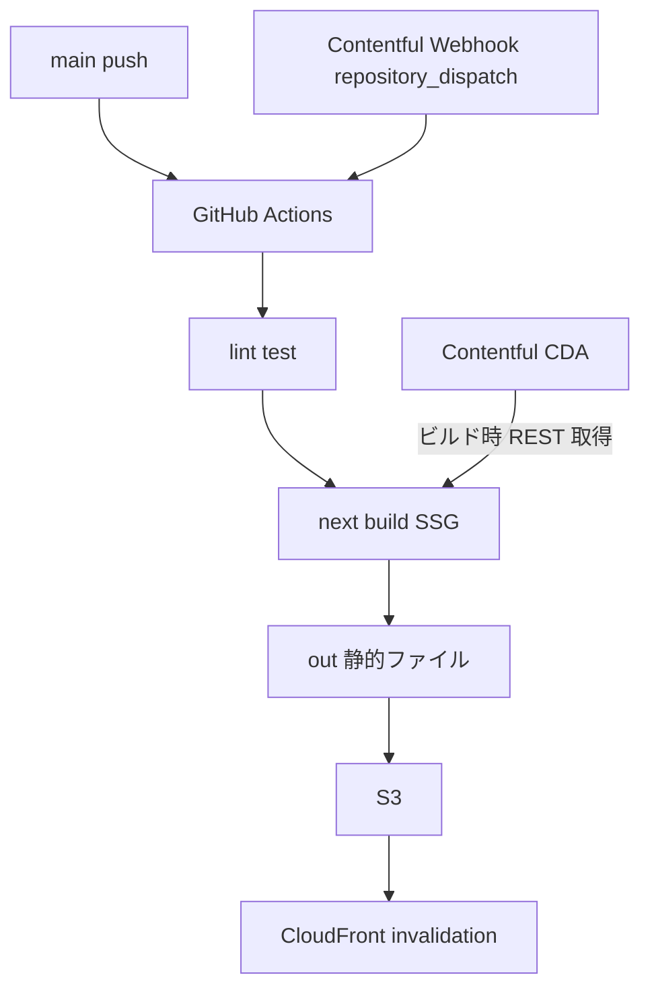
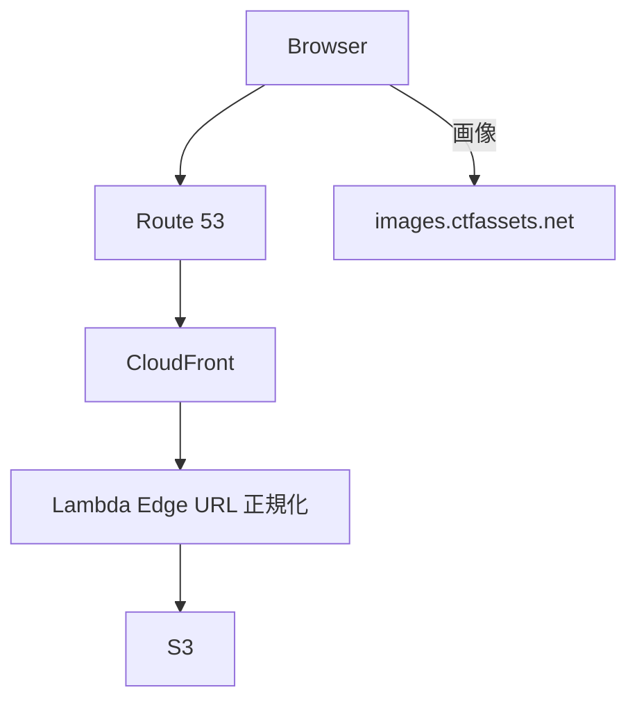
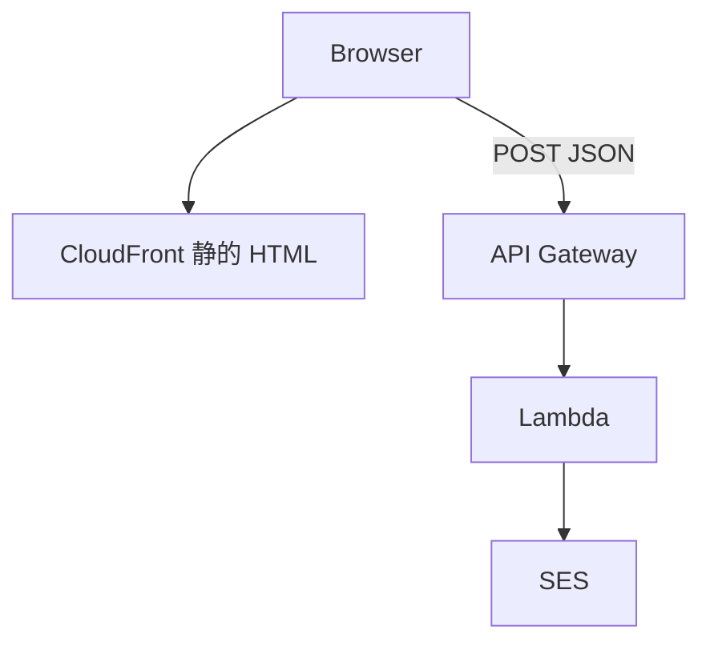

# next-portfolio

[msykn.com](https://msykn.com/) のソースコード。Nuxt.js 版から Next.js App Router へリプレイスした個人ポートフォリオサイトです。

旧リポジトリ: [nuxt-portfolio](https://github.com/masayukinii1011/nuxt-portfolio)

## 技術スタック

| 領域 | 採用技術 |
| --- | --- |
| フロント | Next.js 16 (App Router) / React 19 / TypeScript |
| UI | shadcn/ui / Tailwind CSS |
| CMS | Contentful (REST CDA) |
| ホスティング | S3 + CloudFront + Route 53 |
| コンタクト | Lambda + API Gateway + SES |
| CI/CD | GitHub Actions |
| 品質 | Biome / Vitest |

## アーキテクチャ

### ビルド時（CI/CD）



### 閲覧時（ランタイム）



### 問い合わせ（ランタイム・別系統）



`output: "export"`。Contentful はビルド時のみ。問い合わせだけ API Gateway 直 POST（Server Actions 不可）。ページ一覧は [docs/architecture.md](docs/architecture.md#ページ構成)。

## セットアップ

```bash
npm ci
# .env.local — docs/runbook.md「ローカル開発」「環境変数」
npm run dev
```

## ドキュメント

| ドキュメント | 内容 |
| --- | --- |
| [docs/runbook.md](docs/runbook.md) | ローカル開発、スクリプト、デプロイ、障害時 |
| [docs/architecture.md](docs/architecture.md) | ページ構成、ディレクトリ、データ流れ |
| [docs/content-model.md](docs/content-model.md) | Contentful フィールドと category |
| [docs/adr.md](docs/adr.md) | 技術選定 ADR |
| [src/app/contentful.ts](src/app/contentful.ts) | CDA 取得（コード正本） |
| [src/lib/contentful-utils.ts](src/lib/contentful-utils.ts) | Entry 変換（コード正本） |
