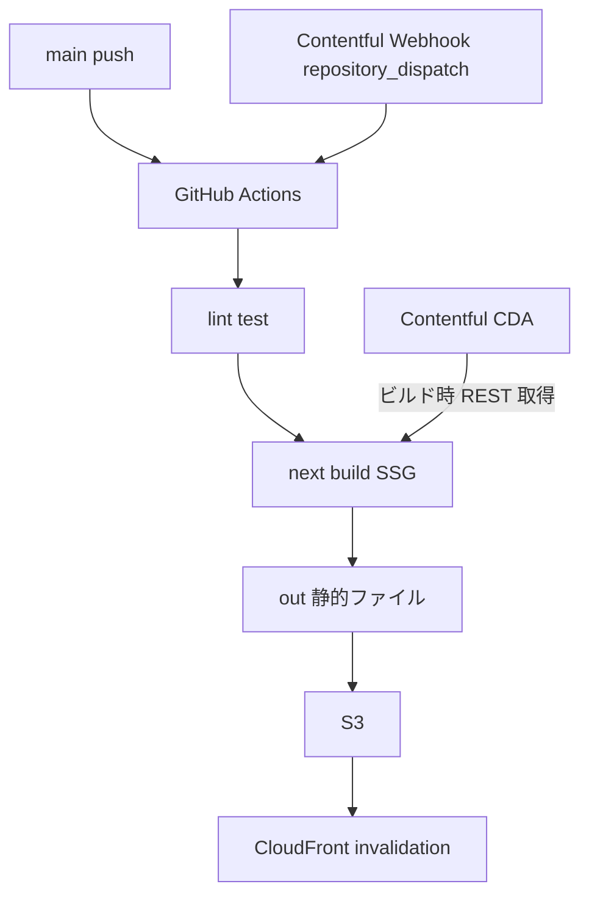
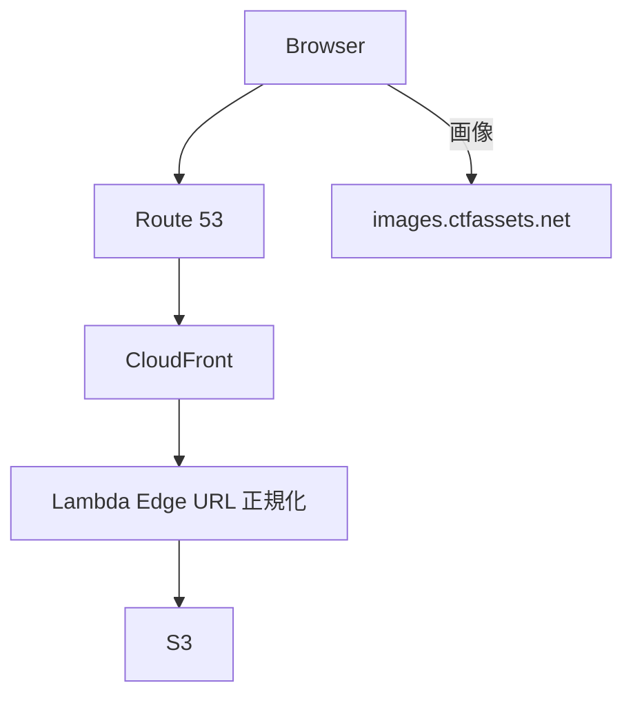
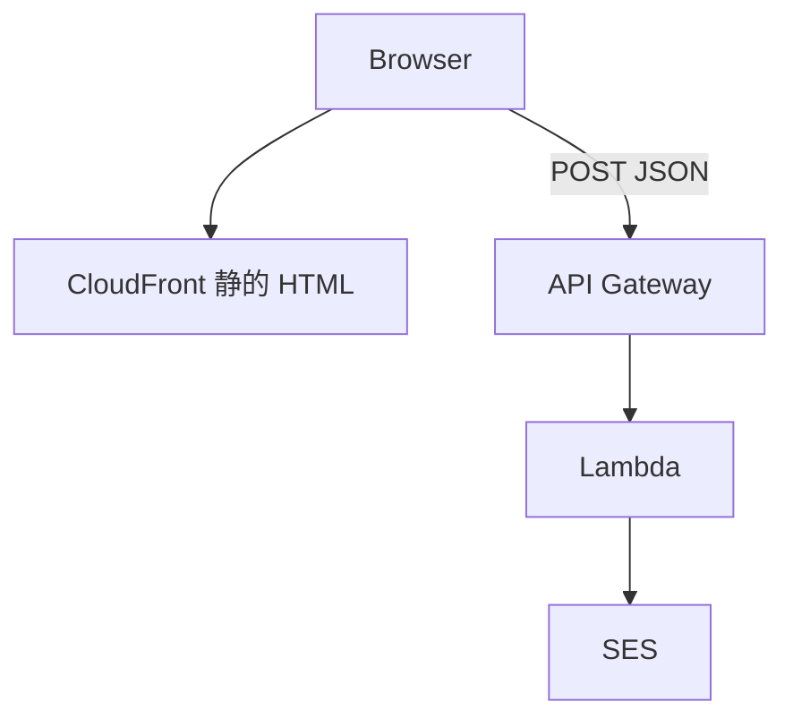

# next-portfolio

[msykn.com](https://msykn.com/) のソースコード。Nuxt.js 版から Next.js App Router へリプレイスした個人ポートフォリオサイトです。

旧リポジトリ: [nuxt-portfolio](https://github.com/masayukinii1011/nuxt-portfolio)

## 技術スタック

| 領域 | 採用技術 |
| --- | --- |
| フロント | Next.js 16 (App Router) / React 19 / TypeScript |
| UI | shadcn/ui / Tailwind CSS |
| CMS | Contentful (REST CDA) |
| ホスティング | S3 + CloudFront + Route 53 |
| コンタクト | Lambda + API Gateway + SES |
| CI/CD | GitHub Actions |
| 品質 | Biome / Vitest |

## アーキテクチャ

### ビルド時（CI/CD）



### 閲覧時（ランタイム）



### 問い合わせ（ランタイム・別系統）



`output: "export"`。Contentful はビルド時のみ。問い合わせだけ API Gateway 直 POST（Server Actions 不可）。

## ページ構成

| パス | 内容 |
| --- | --- |
| `/` | ヒーロー・CTA・最新 Works |
| `/about` | プロフィール・スキル（Contentful） |
| `/works` | 作品一覧（Contentful） |
| `/works/[slug]` | 作品詳細（Contentful） |
| `/music` | 音楽活動（Contentful + embed） |
| `/contact` | 問い合わせフォーム（Contentful + Lambda） |

## セットアップ

```bash
npm ci
# .env.local に CTF_* と SEND_MESSAGE_API（一覧は docs/runbook.md）
npm run dev
```

| コマンド | 内容 |
| --- | --- |
| `npm run dev` | 開発サーバー |
| `npm run lint` | Biome |
| `npm run test` | Vitest |
| `npm run build` | 静的エクスポート (`out/`) |

デプロイは `main` push または Contentful Webhook → Actions → S3 sync → CloudFront invalidation。

## ドキュメント

| ドキュメント | 内容 |
| --- | --- |
| [docs/architecture.md](docs/architecture.md) | ディレクトリ、データ流れ、Client 境界 |
| [docs/content-model.md](docs/content-model.md) | Contentful フィールドと category |
| [docs/runbook.md](docs/runbook.md) | 環境変数、CI secrets、障害時 |
| [docs/adr/README.md](docs/adr/README.md) | 技術選定 ADR |
| [src/app/contentful.ts](src/app/contentful.ts) | CDA 取得（コード正本） |
| [src/lib/contentful-utils.ts](src/lib/contentful-utils.ts) | Entry 変換（コード正本） |
